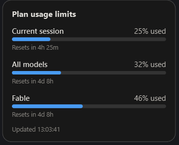

# Claude Usage Widget

> **Unofficial community project.** Not affiliated with, endorsed by, or
> sponsored by Anthropic. "Claude" is a trademark of Anthropic. This tool only
> reads the OAuth login that Claude Code already stores on your own machine and
> calls the same usage endpoint Claude Code uses — it stores no secrets of its
> own.

A small always-on-top floating desktop widget for **Windows, macOS, and Linux**
that shows your **live claude.ai / Claude subscription usage** — the same
"Plan usage limits" panel you see inside the app:

- **Current session** (the rolling 5-hour window) — % used + reset countdown.
- **Weekly limits** — "All models", plus any model-scoped limit (e.g. Fable),
  each with % used and reset time.

<p align="center">
  
</p>

The numbers are **real**. They come from the authenticated usage endpoint that
Claude Code itself calls:

```
GET https://api.anthropic.com/api/oauth/usage
```

## How the auth works (and why there's nothing to paste)

There is no public *API key* for subscription usage — it lives behind the
OAuth login used by the Claude app / Claude Code. This widget piggybacks on the
login **Claude Code has already stored on this machine**:

| Platform      | Where the token is read from                          |
| ------------- | ----------------------------------------------------- |
| Windows/Linux | `~/.claude/.credentials.json`                         |
| macOS         | login **Keychain**, service `Claude Code-credentials` |

The widget reads the OAuth access token from that source **fresh on every
refresh**. It never copies, caches, or transmits the token anywhere except in
the `Authorization` header of the request to `api.anthropic.com`. Because it
re-reads it each time, when Claude Code rotates the token in the background the
widget just keeps working.

> On macOS the widget shells out to the built-in `security` tool to read the
> Keychain item. The first time it does so, macOS may prompt you to allow
> access — click **Always Allow** so refreshes stay silent.

If you see an auth error, run Claude Code once (which refreshes the login) and
the widget will recover on its next refresh.

> **Requirement:** you must be logged in to Claude Code on this machine
> (`claude` CLI, run at least once). No login file → no data.

## Download

Prebuilt standalone apps for each OS are attached to every
[GitHub Release](../../releases) — no Python needed:

- **Windows** — `ClaudeUsageWidget-windows.zip` → unzip → run `ClaudeUsageWidget.exe`.
- **macOS** — `ClaudeUsageWidget-macos.zip` → unzip → move `ClaudeUsageWidget.app`
  to Applications. The app is **unsigned**, so on first launch macOS Gatekeeper
  will block it: **right-click the app → Open → Open** (only needed once).
- **Linux** — `ClaudeUsageWidget-linux.tar.gz` → extract → `./ClaudeUsageWidget`.

Prefer to run from source? See **Setup** below.

## Setup

1. Install Python 3.10+.
2. In this folder:
   ```
   pip install -r requirements.txt
   python main.py        # or python3 main.py on macOS/Linux
   ```
3. Drag the widget anywhere. Right-click (or use the tray icon) for the menu:
   **Refresh now**, **Settings**, **Show last API response**, **Quit**.

Settings lets you change the refresh interval (default 60s), point at a custom
credentials path, and toggle **Start at login**.

Config lives at `%APPDATA%\ClaudeUsageWidget\` (Windows),
`~/Library/Application Support/ClaudeUsageWidget/` (macOS), or
`~/.config/ClaudeUsageWidget/` (Linux).

## Building a standalone app

Run the build script for your platform — each calls PyInstaller and needs no
Python install to run the result. **Build on the platform you're targeting**
(a Mac app must be built on a Mac, etc.):

| Platform | Command      | Output                        |
| -------- | ------------ | ----------------------------- |
| Windows  | `build.bat`  | `dist\ClaudeUsageWidget.exe`  |
| macOS    | `./build.sh` | `dist/ClaudeUsageWidget.app`  |
| Linux    | `./build.sh` | `dist/ClaudeUsageWidget`      |

Tick **Start at login** in Settings to have it launch automatically. This adds
a single, easily-removed entry per platform — a registry Run key (Windows), a
LaunchAgent plist in `~/Library/LaunchAgents/` (macOS), or an XDG
`~/.config/autostart/*.desktop` file (Linux). The machine it runs on still
needs a logged-in Claude Code for the token.

> **Linux note:** the widget uses a system-tray icon. Most desktops show it out
> of the box; some GNOME setups need a "tray icon" / "AppIndicator" extension
> for the tray menu to appear. You can always right-click the widget itself for
> the same menu.

## Notes on the data

- Usage can lag slightly behind real-time; the session/weekly percentages and
  reset times mirror what the app shows.
- Bar colour follows the severity the API reports: blue = comfortable,
  amber = getting close, red = nearly exhausted.
- Use **Show last API response...** in the menu to see the raw JSON and
  sanity-check anything.

## Files

- `main.py` — the whole app (single-file PySide6 GUI + background thread that
  polls the OAuth usage endpoint).
- `requirements.txt` — Python deps (PySide6, requests).
- `build.bat` (Windows) / `build.sh` (macOS + Linux) / `ClaudeUsageWidget.spec`
  — PyInstaller packaging.

## History

Earlier versions tried to approximate subscription limits with a *manual*
counter, because the data "had no API". It turns out it does — the OAuth
`/usage` endpoint above — so the manual tracker and the separate Admin-API
dollar-cost view were removed in favour of the real thing.

## License

[MIT](LICENSE) © PJM Development. Unofficial community project; not affiliated
with Anthropic.
